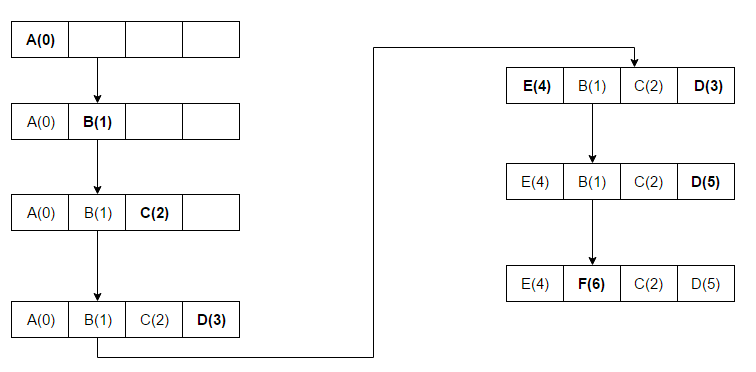

= Least recently used (LRU)

Discards the least recently used items first.

This algorithm requires keeping track of what was used when, which is expensive if one wants to make sure the algorithm always discards the least recently used item.

General implementations of this technique require keeping "age bits" for cache-lines and track the "Least Recently Used" cache-line based on age-bits.
In such an implementation, every time a cache-line is used, the age of all other cache-lines changes.

LRU is actually https://en.wikipedia.org/wiki/Page_replacement_algorithm#Variants_on_LRU[a family of caching algorithms] with members including 2Q by Theodore Johnson and Dennis Shasha, https://en.wikipedia.org/wiki/Cache_replacement_policies#cite_note-3[1] and LRU/K by Pat O'Neil, Betty O'Neil and Gerhard Weikum. https://en.wikipedia.org/wiki/Cache_replacement_policies#cite_note-4[2]

The access sequence for the below example is A B C D E D F.

In the above example once A B C D gets installed in the blocks with sequence numbers (Increment 1 for each new Access) and when E is accessed, it is a miss and it needs to be installed in one of the blocks.
According to the LRU Algorithm, since A has the lowest Rank(A(0)), E will replace A.

In the second last step D is accessed and therefore the sequence number is updated.

LRU, like many other replacement policies, can be characterized using a state transition field in a vector space, which decides the dynamic cache state changes similar to how an electromagnetic field determines the movement of a charged particle placed in it. https://en.wikipedia.org/wiki/Cache_replacement_policies#cite_note-5[3]

Source: https://en.wikipedia.org/wiki/Cache_replacement_policies#Least_recently_used_(LRU)[Wikipedia]